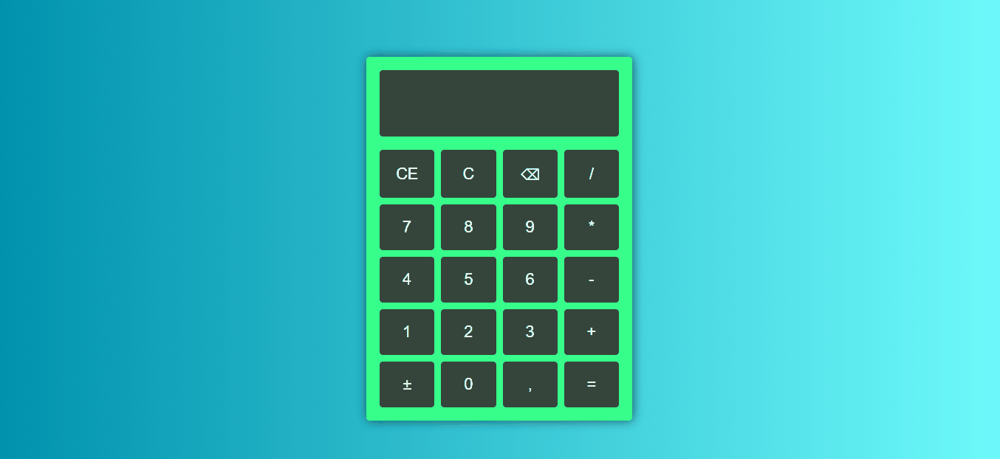

# Calculadora
Esse projeto é uma calculadora simples, feita com HTML5, CSS3 e JAVASCRIPT. Nela você pode fazer as quatro principais operações matemáticas.
 
## 📷 Demo

## Teste no link abaixo:
<a href="https://confident-nightingale-20e6ca.netlify.app/">caculadora.netlify.app/</a>
